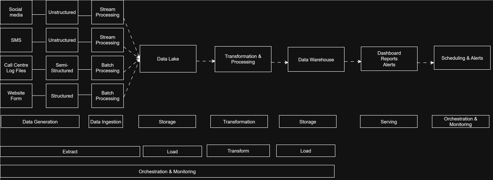

# Conceptual Data Pipeline Project of BeeJan Technologies

## Introduction

Beejan Technologies is one of the fastest-growing telecom companies, serving thousands of customers daily. With such scale comes an increasing volume of customer complaints, ranging from poor network experiences to billing errors and unsatisfactory service interactions. These complaints arrive from multiple channels—social media, call centers, SMS, and website forms—resulting in fragmented data silos.

Currently, management faces challenges in consolidating this data into a single source of truth. Reporting teams manually compile spreadsheets, which delays insights, reduces efficiency, and prevents timely action.

This project introduces a conceptual end-to-end data pipeline that will form the foundation for future implementation. The goal is to ensure that data from all channels flows seamlessly, is cleaned and enriched, and ultimately provides management with accurate, actionable insights.

## Problem Statement

* *Data fragmentation:* Customer complaints are spread across multiple formats (text logs, structured forms, SMS data, social media posts).

* *Manual processes:* Reports are created manually in spreadsheets, leading to human errors and delayed decisions.

* *Lack of integration:* No single unified pipeline exists to combine data sources.

* *Inefficient reporting:* Delays in insights make it difficult for leadership to respond quickly to customer pain points.

* *Siloed teams:* Each department works independently without shared visibility.

## Business Scenario

Every day, thousands of customers attempt to contact Beejan Technologies regarding issues with services. Complaints can include:

* Network quality problems (dropped calls, slow internet).

* Billing disputes (overcharges, incorrect plans).

* Poor customer support experiences.

Because these complaints come from multiple channels, they arrive in diverse formats. For example:

* Social media: Unstructured, free-text complaints with hashtags and slang.

* Call centers: Semi-structured log files containing timestamps, call durations, and issue tags.

* SMS: Unstructured, short-text complaint codes.

* Web forms: Structured tabular data with customer IDs and issue categories.

Without a unified pipeline, the company struggles to derive meaningful insights, leading to customer dissatisfaction and potential revenue loss.

## The Solution

The solution is to design a centralized conceptual pipeline that acts like a digital assembly line for data.

Here’s what happens along the line after identifying the primary data sources:

* Data Ingestion – Capture every complaint from every source, whether real-time (social media streams) or batch (daily logs, form submissions).

* Raw Data Storage – Drop everything into a safe holding area (a conceptual data lake) where nothing is lost, no matter the format.

* Data Cleaning & Standardization – Polish the data: remove duplicates, fix broken entries, and give every piece a common structure.

* Data Enrichment – Add more context: tag complaints by category, link them to customer IDs, and add geographic or time-based information.

* Data Transformation – Reshape the enriched data into well-modeled formats, such as complaint fact tables linked to dimension tables like customer, region, or issue type.

* Curated Data Storage – Store the refined data in a conceptual warehouse, optimized for fast querying and analysis.

* Analytics & Reporting – Feed the clean, structured data into dashboards and KPIs so managers and analysts can see real-time trends.

## Conceptual Architecture Diagram
Below is the conceptual architecture diagram for the pipeline for Beejan technologies

## 6. Lifecycle of the Pipeline

The pipeline is not just a system; it’s a living, breathing cycle of data intelligence:

* *Data Collection (Ingestion)* – Collects all relevant data.

* *Raw Data Storage* – Stores the raw data without discarding anything; raw data may hold hidden value.

* *Data Cleaning & Standardization* – Scrub the data clean, standardize formats, and remove irrelevant noise.

* *Data Enrichment* – Add important and relevant columns tags, categories and metadata that make the data more useful.

* *Data Transformation* – Transform the data into structured, consistent, and analysis-ready.

* *Curated Data Storage* – Place the data warehouse where anyone (analyst, manager, executive) can grab what they need.

* *Analytics & Reporting* – Serve insights on silver platters: dashboards showing complaint volumes, resolution times, or root causes.

## 7. Expected Benefits

By implementing this conceptual pipeline, Beejan Technologies stands to gain:

* *Lightning-fast insights* – Complaints analyzed in near real-time instead of waiting days for reports.

* *A single source of truth* – One unified view of customer pain points for all teams.

* *Better decision-making* – Management acts on trends before they snowball into crises.

* *Higher customer satisfaction* – Faster response times, fewer repeated complaints, happier customers.

* *Scalable growth* – The architecture can easily absorb new data channels as the business expands.

* *Efficiency boost* – Analysts focus on insights, not on moving spreadsheets around.

## Final Thoughts

This conceptual pipeline is like building a nervous system for Beejan Technologies. Every complaint becomes a signal. The pipeline acts as the brain that collects, cleans, enriches, and translates those signals into actions.

Instead of reacting slowly, Beejan can now predict, respond, and adapt quickly, keeping customers happy and loyal while staying ahead of competitors.

